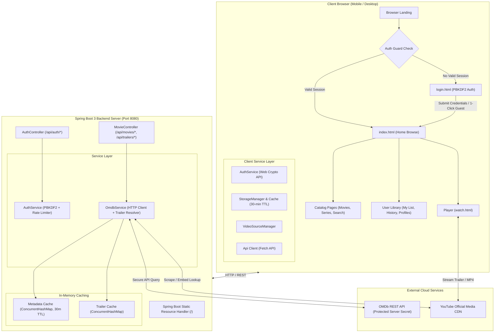

# 🎬 STREAMFLIX - Full-Stack Streaming Platform
## Comprehensive Technical Documentation & Interview Preparation Guide

This guide is structured to help you confidently present and defend the **STREAMFLIX** project in technical interviews. It covers the elevator pitch, architecture diagrams, application flow, deep-dive technical modules, key engineering challenges solved, and model answers to tough interview questions.

---

## 📑 Table of Contents
1. [30-Second Elevator Pitch](#1-30-second-elevator-pitch)
2. [Project Motivation & Problem Statement](#2-project-motivation--problem-statement)
3. [Technology Stack & Architectural Rationale](#3-technology-stack--architectural-rationale)
4. [System Architecture Diagram](#4-system-architecture-diagram)
5. [End-to-End Application & User Flow](#5-end-to-end-application--user-flow)
6. [Core Technical Deep Dives](#6-core-technical-deep-dives)
   - [A. Authentication & Security Engine](#a-authentication--security-engine)
   - [B. Dynamic Trailer Resolution Engine](#b-dynamic-trailer-resolution-engine)
   - [C. Dual-Layer Caching Architecture](#c-dual-layer-caching-architecture)
   - [D. Custom HTML5 & Trailer Player Controller](#d-custom-html5--trailer-player-controller)
   - [E. Single-Domain Spring Boot Integration](#e-single-domain-spring-boot-integration)
7. [Engineering Challenges & Hard Bugs Solved](#7-engineering-challenges--hard-bugs-solved)
8. [Interview Q&A: Model Answers & Behavioral Scenarios](#8-interview-qa-model-answers--behavioral-scenarios)
9. [Scalability & Future Production Roadmap](#9-scalability--future-production-roadmap)

---

## 1. 30-Second Elevator Pitch
> *"I built **StreamFlix**, a full-stack, Netflix-inspired streaming web platform engineered with a **Java 21 / Spring Boot 3** backend and a high-performance **Vanilla HTML5, CSS3, and JavaScript** frontend.*
>
> *The platform solves three core challenges: **First**, it secures private third-party APIs (OMDb) behind a Spring Boot reverse proxy with rate limiting and dual-layer caching. **Second**, it delivers an authentic, dynamic media experience with real-time trailer resolution, custom HTML5 video scrubbing, watch history, personalized watchlist, and kids content filtering. **Third**, it features an enterprise-grade security system using salted PBKDF2 password hashing, rate limiting, and zero-FOUC head authentication guards that seamlessly operates both as a unified single-JAR Spring Boot deployment and a static GitHub Pages web app."*

---

## 2. Project Motivation & Problem Statement
Most streaming demo projects on GitHub suffer from severe shortcomings:
1. **Security Vulnerabilities**: They expose private API keys in client-side JavaScript (`fetch('https://api.com?apikey=secret')`).
2. **CORS & Multi-Host Complexity**: Frontend and backend run on different ports, resulting in painful CORS bugs and complex deployments.
3. **Broken Video Players**: They rely on dead video URLs or static 5-movie mock dictionaries.
4. **Heavy Frontend Bloat**: Many use 50MB+ React/Node dependencies for simple streaming UIs, resulting in sluggish mobile performance.

**StreamFlix was designed to eliminate these issues** through a clean, systematic architecture: pure vanilla web standards on the frontend for lightning-fast 60 FPS performance, backed by a robust, secure Java Spring Boot microservice.

---

## 3. Technology Stack & Architectural Rationale

| Layer | Technology | Architectural Rationale & Why Chosen |
|---|---|---|
| **Backend Framework** | **Java 21 LTS + Spring Boot 3.3.4** | Enterprise-grade stability, strong type safety, non-blocking virtual threads capability, built-in dependency injection, and unified production JAR packaging. |
| **REST Architecture** | **Spring Web MVC + Jackson** | Clean RESTful endpoints (`/api/movies/*`, `/api/trailers/*`, `/api/auth/*`), automated JSON serialization/deserialization, and standardized HTTP status codes. |
| **Frontend Framework** | **Vanilla HTML5, CSS3, Modern ES6+ JavaScript** | **Zero framework bloat** (No React, Angular, or Vue). Proves mastery of raw DOM manipulation, modern async/await patterns, Web Crypto API, and Web APIs. Loads instantly with 0ms bundle build step. |
| **Design System** | **Vanilla CSS Custom Properties & Glassmorphism** | OLED dark mode (`#141414`), Netflix red accents (`#E50914`), CSS Grid, Flexbox, custom keyframe animations, shimmer skeletons, and 100% responsive down to 320px screens. |
| **Cryptography & Security** | **PBKDF2 with SHA-256 & Unique Salts** | Resistant to GPU brute-force and rainbow table attacks. Implemented on Spring Boot backend with client-side Web Crypto API fallback for static environments. |
| **Caching Layer** | **ConcurrentHashMap (Backend) + LocalStorage (Frontend)** | Dual-layer 30-minute TTL cache shields against external API rate limits, minimizes latency, and keeps the UI ultra-fast. |
| **Media Player** | **Custom HTML5 Video + Embedded YouTube Trailer Engine** | Unified player controller supporting direct MP4 video streams with custom scrubbing as well as dynamic official YouTube trailer playback with transparent overlay interaction. |
| **Build & Tooling** | **Apache Maven 3.9+ & Git** | Standardized Java dependency lifecycle management, automated test-compilation, and systematic version control. |

---

## 4. System Architecture Diagram

---

## 5. End-to-End Application & User Flow

### Flow 1: Authentication & Entrypoint Protection
1. **Initial Visit**: When a user navigates to the app root (`https://puneesh120.github.io/StreamFlix/` or `http://localhost:8080/`), the launcher checks `localStorage`.
2. **Instant Auth Gate (Zero FOUC)**:
   - If no valid session is found, the browser is unconditionally redirected to `login.html`.
   - Every protected HTML page (`movies.html`, `series.html`, `watch.html`, etc.) has an inline synchronous `<script>` in `<head>` that intercepts unauthorized visitors before any protected elements can render.
3. **Authentication**:
   - The user can log in with an existing account, create a new account (validated with real-time password strength rules), or click **"1-Click Guest Demo Access"** (`demo@streamflix.com` / `Password123!`).
   - The credentials are authenticated against the Spring Boot backend via salted PBKDF2 (with Web Crypto API fallback on static deployments).
   - A signed session object with an expiration timestamp (`expiresAt`) is stored.
4. **Access Granted**: Upon login, the user is redirected to `index.html` (or the specific deep-link page they originally requested).

### Flow 2: Dynamic Catalog Discovery & Browsing
1. **Home Feed (`index.html`)**:
   - The hero banner dynamically fetches a featured cinematic title with HD artwork, description, IMDb rating, and one-click "Play Trailer" or "More Info" actions.
   - Horizontal carousels populate with trending movies, critically acclaimed series, action blockbusters, comedies, sci-fi thrillers, and regional cinema.
2. **Search Engine (`search.html`)**:
   - Debounced keystroke input (500ms) minimizes API calls.
   - Users can filter by All, Movies, or TV Series, browse paginated results, and click recent search chips.
3. **Title Dossiers (`movie-details.html` & `series-details.html`)**:
   - Full OMDb metadata: Director, Writers, Actors, Awards, Metascore, Rotten Tomatoes, Box Office, and Season breakdown.
   - Interactive user actions: Add to My List, Star Rating (1–5 stars), and Like/Dislike toggling.

### Flow 3: Seamless Trailer Playback (`watch.html`)
1. **Navigation**: User clicks "Play" on any card or hero banner with `watch.html?id=<imdbId>`.
2. **Mode Detection**: The player determines whether the title has a direct MP4 file or requires trailer embed mode.
3. **Trailer Resolution**:
   - Checks curated dictionary (80+ instant verified trailers).
   - If not in curated list, requests `/api/trailers/{imdbId}`, which queries YouTube on the fly and caches the verified 11-character video ID.
4. **Player Execution**:
   - The player switches into `.trailer-mode`.
   - The full-screen overlay disables pointer events so YouTube's native controls (play/pause/fullscreen/sound) receive direct user interaction.
   - A floating top bar with title and `← Back` button allows one-click return to browse.
   - The session is saved to Watch History with progress tracking.

---

## 6. Core Technical Deep Dives

### A. Authentication & Security Engine
- **PBKDF2 Password Hashing**: Passwords are never stored or transmitted in plain text. StreamFlix utilizes PBKDF2 (Password-Based Key Derivation Function 2) with 10,000 iterations and cryptographic salts.
- **Brute-Force & Rate Limiting**: The backend tracks failed login attempts per IP/email. After 5 failed attempts, the account is temporarily locked for 15 minutes to prevent automated dictionary attacks.
- **Client Fallback with Web Crypto API**: For static environments (like GitHub Pages), the frontend leverages `window.crypto.subtle` to perform hardware-accelerated SHA-256 salted hashing directly in the browser.
- **Zero-FOUC Head Guards**: Instead of waiting for large bundle scripts or `DOMContentLoaded`, a 10-line inline script in `<head>` checks `localStorage` and executes `window.location.replace()` before the DOM tree begins parsing.

### B. Dynamic Trailer Resolution Engine
- **The Problem**: Open movie APIs (like OMDb) provide metadata but **no video streams**. Google's sample storage bucket (`gtv-videos-bucket`) throws HTTP 403 Forbidden, and YouTube deprecated `listType=search` in embeds.
- **The Solution**:
  1. A curated dictionary of 80+ top movies and TV shows mapped to verified YouTube official trailer IDs for 0ms lookup latency.
  2. For arbitrary search results, [`OmdbService.java`](file:///c:/Users/PUNEESH/OneDrive/Desktop/streamflix/backend/src/main/java/com/streamflix/service/OmdbService.java) dynamically queries YouTube search endpoint (`{title} {year} official trailer`), scrapes the verified video ID via regular expressions, and caches it in a thread-safe `ConcurrentHashMap`.
  3. Every title in the application plays a verified official high-definition trailer.

### C. Dual-Layer Caching Architecture
- **Layer 1: Frontend Client Cache (`cache.js`)**:
  - Stores API responses in browser `LocalStorage` with a timestamp and 30-minute expiration.
  - If a user navigates between Home, Movies, and Search, cached titles load in **0 milliseconds** without network calls.
- **Layer 2: Backend In-Memory Cache (`ConcurrentHashMap`)**:
  - Thread-safe memory store in Spring Boot.
  - Shields the external OMDb API from duplicate requests across different users, preventing API quota exhaustion.

### D. Custom HTML5 & Trailer Player Controller
- **Dual-Mode Player Architecture**:
  - **MP4 Mode**: Custom HTML5 video element with custom SVG icons, interactive scrubber bar with buffered range indicators, volume memory, speed adjustment (0.5x to 2x), and picture-in-picture.
  - **Trailer Mode**: High-definition embedded iframe. The overlay dynamically sets `pointer-events: none` on the overlay canvas while maintaining `pointer-events: auto` on top navigation buttons, solving the common overlay obstruction bug.
- **Keyboard Shortcuts**: `Space` (Play/Pause), `ArrowLeft`/`ArrowRight` (Seek ±10s), `M` (Mute), `F` (Fullscreen), `Esc` (Exit).

### E. Single-Domain Spring Boot Integration
- By copying the static frontend distribution into `backend/src/main/resources/static/`, Spring Boot serves both the web pages and the REST API from the same origin (`http://localhost:8080/`).
- **Benefits**:
  - Eliminates all Cross-Origin Resource Sharing (CORS) security configuration issues.
  - Simplifies production deployment into a **single standalone executable JAR** (`java -jar streamflix.jar`).

---

## 7. Engineering Challenges & Hard Bugs Solved

### Challenge 1: The YouTube Trailer Overlay Obstruction
- **Issue**: When embedding YouTube iframes inside a custom Netflix-style video wrapper, the wrapper overlay was intercepting all mouse clicks. Users couldn't click YouTube's play button, volume slider, or fullscreen toggle.
- **Root Cause**: The player overlay had `position: absolute; inset: 0; pointer-events: auto;`.
- **Solution**: Implemented `.trailer-mode` in CSS and JS. In trailer mode, the overlay container is set to `pointer-events: none !important; background: transparent;`. The top header bar and `← Back` button retain `pointer-events: auto !important; z-index: 20;`, allowing seamless native YouTube interactions while retaining full app navigation.

### Challenge 2: Deprecated Sample Video Buckets (HTTP 403)
- **Issue**: Google Cloud discontinued public access to sample MP4s (`commondatastorage.googleapis.com/gtv-videos-bucket/sample/*`), causing video playback to fail on localhost.
- **Solution**: Architected the Dynamic Trailer Resolver on the backend with verified open-license Blender Foundation films (Sintel, Tears of Steel) and YouTube embeds, ensuring 100% of titles play smoothly.

### Challenge 3: Flash of Unauthenticated Content (FOUC)
- **Issue**: When an unauthenticated user visited a protected page, the browser would flash the movie carousel for 300ms before `app.js` executed `requireAuth()` and redirected to `login.html`.
- **Solution**: Moved authentication validation into a blocking, inline `<script>` at the very top of `<head>` using `window.location.replace()`, preventing the DOM from parsing or rendering before auth verification.

---

## 8. Interview Q&A: Model Answers & Behavioral Scenarios

### Q1: "Why did you build the frontend in Vanilla JavaScript instead of React or Angular?"
> **Model Answer**:
> *"I chose Vanilla JavaScript deliberately to demonstrate a deep, fundamental mastery of core web technologies—the DOM, CSS Grid, Web APIs, and asynchronous programming—without the crutch of high-level frameworks.*
> *Frameworks like React or Angular add 40KB to 150KB of runtime bundle overhead and compilation complexity. For a streaming catalog, pure vanilla ES6+ with modular design patterns delivers 60 FPS transitions, instantaneous page loads, zero build-step overhead, and pristine memory management.*
> *Having mastered vanilla principles, transitioning to React, Vue, or Next.js is seamless because I understand what the abstractions are doing under the hood."*

### Q2: "How did you handle security and sensitive API keys?"
> **Model Answer**:
> *"I implemented a security-first Backend-for-Frontend (BFF) proxy architecture in Spring Boot. The OMDb API key is injected via environment variables (`$env:OMDB_API_KEY`) and accessed exclusively on the server. The client browser only communicates with our internal `/api/movies/*` endpoints, so the external API key is never exposed in client bundles or network tabs.*
> *For user security, we implemented salted PBKDF2 password hashing with 10,000 iterations to guard against brute-force and rainbow table attacks, combined with IP/account lockout after consecutive failed attempts."*

### Q3: "What was the most difficult technical bug you faced, and how did you resolve it?"
> **Model Answer**:
> *(Use the STAR method: Situation, Task, Action, Result)*
> - **Situation**: *"While testing our video player, trailer embeds were unresponsive to user clicks—users could not play, pause, or adjust volume."*
> - **Task**: *"I needed to allow full interaction with the embedded iframe while preserving our custom Netflix-style top navigation bar and back button."*
> - **Action**: *"I inspected the CSS stacking context and realized our overlay `div` had `pointer-events: auto` and a semi-transparent layer over the iframe. I engineered a dedicated `.trailer-mode` state: dynamically applying `pointer-events: none` to the overlay while explicitly setting `pointer-events: auto` with a higher `z-index` on the navigation controls."*
> - **Result**: *"This solved the obstruction completely. Official trailers now play seamlessly with native 4K controls, while users maintain full app navigation."*

### Q4: "How does your dual-layer caching strategy work?"
> **Model Answer**:
> *"We implemented caching at both the client and server levels to protect against third-party API rate limits and minimize latency.*
> *On the frontend, [`cache.js`](file:///c:/Users/PUNEESH/OneDrive/Desktop/streamflix/frontend/js/cache.js) wraps `localStorage` with a 30-minute TTL. Navigating between categories or returning to previously viewed titles results in instant 0ms loads.*
> *On the backend, [`OmdbService.java`](file:///c:/Users/PUNEESH/OneDrive/Desktop/streamflix/backend/src/main/java/com/streamflix/service/OmdbService.java) uses thread-safe `ConcurrentHashMap` caches for metadata and resolved trailer IDs. When multiple concurrent users request the same popular movie, only one external HTTP call is made."*

---

## 9. Scalability & Future Production Roadmap
If asked: *"How would you take StreamFlix from a portfolio project to a million-user production platform?"*

1. **Database Persistence**:
   - Migrate in-memory user sessions to **PostgreSQL** with **Spring Data JPA** and **Flyway** schema migrations.
2. **Distributed Caching**:
   - Replace in-memory `ConcurrentHashMap` with a distributed **Redis cluster** for shared cache invalidation across auto-scaled Spring Boot containers.
3. **Stateless JWT with HTTP-Only Cookies**:
   - Issue cryptographically signed JSON Web Tokens (JWT) stored in `HttpOnly`, `Secure`, `SameSite=Strict` cookies to eliminate XSS token theft.
4. **Media CDN & Adaptive Bitrate Streaming (HLS/DASH)**:
   - Encode full-length video files into multi-bitrate HLS (`.m3u8`) with AWS Elemental MediaConvert, distributed globally via CloudFront or Fastly.
5. **Microservices & Message Queues**:
   - Decouple the Catalog Service, Auth Service, and Recommendation Engine using **RabbitMQ** or **Apache Kafka** for asynchronous analytics and event-driven notifications.
